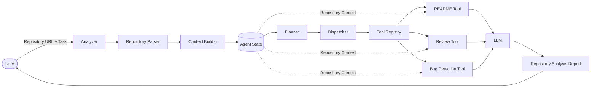

# GitAnalyzer

> An AI-powered GitHub repository analyzer that leverages a modular agent architecture to generate repository insights, code reviews, bug analysis, and documentation using Large Language Models.


---

# Overview

GitHub Analyzer is an intelligent repository analysis system designed using an **Agent-Based Architecture**. Instead of directly sending repository files to an LLM, the system follows a structured pipeline that:

- Parses repository contents
- Builds contextual information
- Plans which analysis tool to execute
- Dispatches the appropriate tool
- Generates AI-powered insights

The architecture is modular, making it easy to extend with new analysis tools.

---

## 🎥 Project Demo

[](https://docs.google.com/videos/d/10ePbamgTDS-uft2g12I0t-GA6BIg3kJFXIzCB_9SPJA/edit?usp=sharing)

# Features

- Repository Parsing
- Intelligent Context Building
- Agent-Based Execution Pipeline
- README Generation
- Code Review
- Bug Detection
- Modular Tool Registry
- Shared Agent State
- Extensible Architecture

---

# Architecture



---

# Project Workflow

1. User provides a GitHub repository URL and a task.
2. Repository Parser extracts the repository structure.
3. Context Builder prepares repository context.
4. Context is stored inside the Agent State.
5. Planner selects the appropriate analysis tool.
6. Dispatcher executes the selected tool.
7. Tool queries the LLM using repository context.
8. Generated analysis is returned to the user.

---

# Agent Components

### Analyzer

Main orchestration engine responsible for coordinating the complete workflow.

### Repository Parser

Extracts the repository structure and metadata.

### Context Builder

Builds concise repository context that can be consumed by the LLM.

### Agent State

Stores shared information throughout execution.

- Repository URL
- Repository Context
- User Prompt
- Tool Outputs

### Planner

Determines which tool should execute for the requested task.

### Dispatcher

Invokes the selected tool through the Tool Registry.

### Tool Registry

Maintains a registry of all available analysis tools.

### Analysis Tools

- README Generator
- Code Review
- Bug Detection

### LLM

Generates repository insights using structured prompts and repository context.

---

# Example Usage

```bash
python app.py
```

Provide:

```
Repository URL:
https://github.com/username/repository

Task:
Review the repository
```

The analyzer will generate a structured AI-powered analysis.

---

# Technologies Used

- Python
- Large Language Models (Ollama)
- GitHub Repository Parsing
- Agent-Based Architecture
- Modular Design Pattern

---

# Future Improvements

- Deployment for production Access
- LLM-based Planner
- Multi-step Agent Loop
- Retry & Error Recovery
- Execution History

---

# Why this Project?

Traditional repository analyzers directly send repository contents to an LLM.

This project introduces an **agent-oriented execution model**, separating planning, dispatching, and tool execution into independent components. The modular design makes it straightforward to extend the analyzer with new capabilities while maintaining a clean and scalable architecture.

---

# License

MIT License
